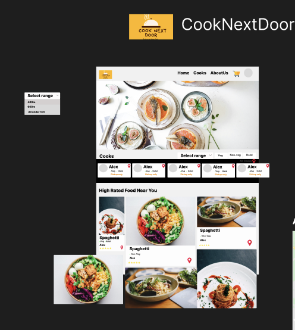
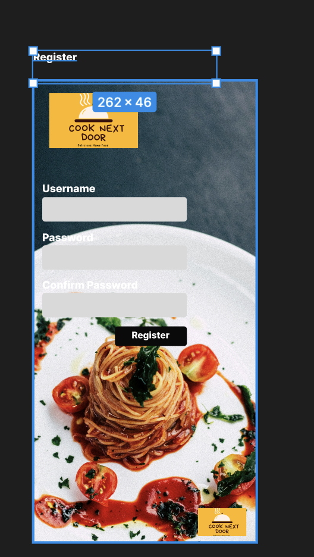
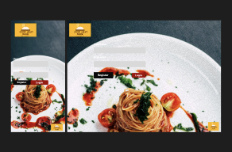
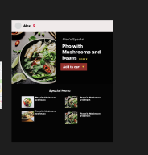
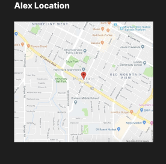
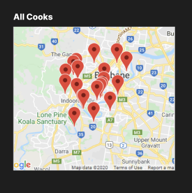
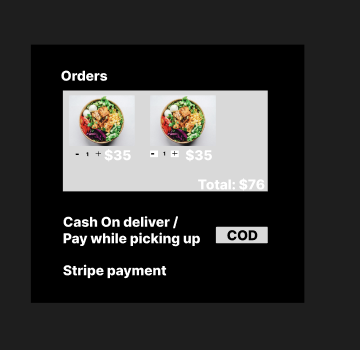

# Project Title

Cook Next Door

## Overview

It's a food app that connects users with neighboring cooks

## Problem

Cook Next Door aims to provide a convenient way for users to enjoy delicious, home-cooked meals while offering home cooks an opportunity to showcase their culinary skills and earn income.

### Benefits:

- For Users:
  Access to a variety of homemade meals.
  Convenience of home delivery or pick-up.
  Opportunity to support local cooks and small businesses.
- For Cooks:
  Platform to reach a wider audience.
  Flexible working hours and additional income.
  Recognition and feedback from the community.

###Instructions to run the project
- run npm i 
- npm run dev   

### User Profile

- For Users:

  - Profiles with preferences,favorite cuisines, and order history.
  - Menu listings with pricing

### Features

- After login, location access permission is taken
- As a logged in user, I can find nearby home cooks from my current location
- As a logged in user, I can find nearby home cooks from any given location
- As a logged in user, I can view the menu of a home cook
- As a logged in user, I can place an order from a home cook
- As a logged in user, I can Filter data by categories
- As a logged in user, I can view the reviews of a home cook
- As a logged in user, I can choose category of food (if its Veg, non-veg, halal etc..)
- As a logged in user, I can place order and pay via COD (cash on delivery)
- A hero Image showing if any offers or discounts or in general a food Image if theres no offers present
- Ability to filter home cooks by cuisine type
- Ability to locate my neighbour cook in google maps
- Ability to order food from my neighbour cook
- Ability to locate all neighbour cooks in google maps inside 200m
- As a logged in user, I can see my order history.
- As a logged in user, I can add to cart and edit cartby removing items

## Implementation

### Tech Stack

- React
- TypeScript
- MySQL
- Express
- Client libraries:
  - react
  - react-router
  - axios
- Server libraries:
  - knex
  - express
  - bcrypt for password hashing

### Sitemap

- Home page
- List of cooks
- Cooks detail page
- Google maps got one cook or all the cooks near by(200m)
- Filter data by categories
- Cart page with payment method
- Register
- Login

### Mockups

#### Home Page



#### Register Page



#### Login Page



#### View cooks menu page



#### View Map Page for one cook



#### View Map page for all cook



#### orders page



### Endpoints

**POST /users/register**

- Add a user account

Parameters:

- username: User's username
- password: User's provided password

```
[
    {
        "message": "User registered successfully"
    }
]
```

**POST /users/login**

- Login a user

Parameters:

- Username: User's Username
- password: User's provided password

Response:

```
{
    "message": "User logged in successfully"
}
```

**GET /cooks**

- Get cooks, if the user is logged in

Parameters:

- longitude: User-provided location as a number
- latitude: User-provided location as a number

Response:

```
[
{
    "id": 1,
    "name": "Chef Alice",
    "delivery-options": "pick-up only",
    "lat": 22.22,
    "long": 77.44,
    "categories": [
        "veg",
        "non-veg",
        "halal"
    ],
    "menu": [
        {
            "food_id": 1,
            "name": "Pho",
            "rating": 5,
            "price": "$30",
            "description": "Pho is a Vietnamese noodle soup consisting of broth, linguine-shaped"
        },
        {
            "food_id": 2,
            "name": "Spaghetti",
            "rating": 4.5,
            "price": "$40",
            "description": "Spaghetti is a long, thin, solid, cylindrical pasta."
        },
        {
            "food_id": 3,
            "name": "Baklava",
            "rating": 4.5,
            "price": "$30",
            "description": "Baklava is a rich, sweet pastry made of layers of filo"
        },
        {
            "food_id": 4,
            "name": "Pie",
            "rating": 4.5,
            "price": "$50",
            "description": "Pie is a baked dish which is usually made of a pastry dough casing that"
        }
    ]
}
    ...
]
```

**GET /cook/:id**

- Get cook by id, if the user is logged in

Parameters:

- id: cook id as number

Response:

```
{
    "id": 1,
    "name": "Chef Alice",
    "delivery-options": "pick-up only",
    "lat": 22.22,
    "long": 77.44,
    "categories": [
        "veg",
        "non-veg",
        "halal"
    ],
    "menu": [
        {
            "food_id": 1,
            "name": "Pho",
            "rating": 5,
            "price": "$30",
            "description": "Pho is a Vietnamese noodle soup consisting of broth, linguine-shaped"
        },
        {
            "food_id": 2,
            "name": "Spaghetti",
            "rating": 4.5,
            "price": "$40",
            "description": "Spaghetti is a long, thin, solid, cylindrical pasta."
        },
        {
            "food_id": 3,
            "name": "Baklava",
            "rating": 4.5,
            "price": "$30",
            "description": "Baklava is a rich, sweet pastry made of layers of filo"
        },
        {
            "food_id": 4,
            "name": "Pie",
            "rating": 4.5,
            "price": "$50",
            "description": "Pie is a baked dish which is usually made of a pastry dough casing that"
        }
    ]
    }
```

## Roadmap

- Create client

  - react project with routes and boilerplate pages

- Create server

  - express project with routing, with placeholder 200 responses

- Create migrations

- Gather 10 sample cooks geolocations in two different cities

- Create seeds with sample cooks data

- Deploy client and server projects so all commits will be reflected in production

- Feature: List cooks from a given location

  - Implement list cooks page including filter option
  - Store given location in sessionStorage (users location)
  - Create GET users/cooks endpoint

- Feature: View cooks

  - Implement view cooks page
  - Create GET users/cooks/:id

- Feature: Rate cooks

  - Add form input to view cooks page
  - Create POST /ratings
  - States for add & update ratings

- Feature: Home page

- Feature: Create account

  - Implement register page + form
  - Create POST /users/register endpoint

- Feature: Login

  - Implement login page + form
  - Create POST /users/login endpoint

- Bug fixes

- DEMO DAY

## nice to have

- Ability to leave reviews and ratings for cooks.
- Ability to filter home cooks by price range.
- Ability to locate all neighbour cooks in google maps inside 200m-1km
- Payment via stripe
- Feature: Implement JWT tokens
  - Server: Update expected requests / responses on protected endpoints
  - Client: Store JWT in local storage, include JWT on axios calls

```

```
